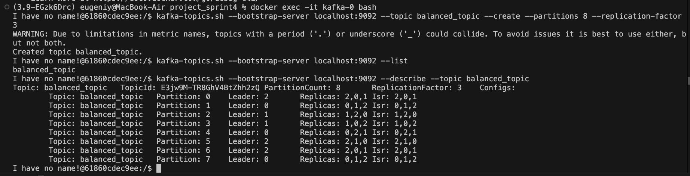
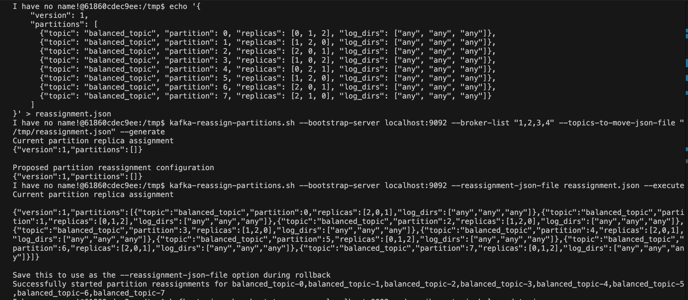
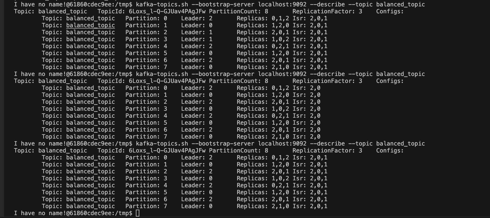

# Task 1. Kafka Partition Reassignment Report

### **Topic:** `balanced_topic`
### **Partition Count:** 8
### **Replication Factor:** 3

---
## **0. Start docker compose**
```bash
docker compose up -d
```

## **1. Initial Partition Assignment**
Creation the topic `balanced_topic` with 8 partitions and replication factor 3.
```bash
kafka-topics.sh --bootstrap-server localhost:9092 --topic balanced_topic --create --partitions 8 --replication-factor 3
```
**Execution Result:**


---

## **2. Reassignment Plan**
A reassignment plan was created with the following target distribution:

```json
{
    "version": 1,
    "partitions": [
      {"topic": "balanced_topic", "partition": 0, "replicas": [0, 1, 2], "log_dirs": ["any", "any", "any"]},
      {"topic": "balanced_topic", "partition": 1, "replicas": [1, 2, 0], "log_dirs": ["any", "any", "any"]},
      {"topic": "balanced_topic", "partition": 2, "replicas": [2, 0, 1], "log_dirs": ["any", "any", "any"]},
      {"topic": "balanced_topic", "partition": 3, "replicas": [1, 0, 2], "log_dirs": ["any", "any", "any"]},
      {"topic": "balanced_topic", "partition": 4, "replicas": [0, 2, 1], "log_dirs": ["any", "any", "any"]},
      {"topic": "balanced_topic", "partition": 5, "replicas": [1, 2, 0], "log_dirs": ["any", "any", "any"]},
      {"topic": "balanced_topic", "partition": 6, "replicas": [2, 0, 1], "log_dirs": ["any", "any", "any"]},
      {"topic": "balanced_topic", "partition": 7, "replicas": [2, 1, 0], "log_dirs": ["any", "any", "any"]}
    ]
}
```
[json file reassignment.json](reassignment.json) 

**Execution Result:**


---

## **3. Post-Reassignment Verification**
After the reassignment, the partition distribution was as follows:


### ✅ **Key Observations:**
All partition is now distributed accordingly to the new plan from the [reassignment.json](reassignment.json)  


---

## **4. Broker Failure Simulation**

### 🔄 **Step-by-Step Process:**

#### a. **Stop broker `kafka-1`:**
```bash
docker stop kafka-1
```

#### b. **Check Topic State After Failure:**
```bash
kafka-topics.sh --describe --topic balanced_topic --bootstrap-server kafka-0:9092,kafka-2:9092
```

**Observed State:**


#### ⚠️ **Key Findings After Failure:**
- The ISR set temporarily excluded broker `kafka-1` (`ISR: 2,0`).
- Leadership successfully switched to available brokers.

---

#### c. **Restart broker `kafka-1`:**
```bash
docker start kafka-1
```

#### d. **Verify Replica Synchronization:**
```bash
kafka-topics.sh --describe --topic balanced_topic --bootstrap-server kafka-0:9092,kafka-2:9092,kafka-1:9092
```

**Final State:**
```
Topic: balanced_topic   TopicId: 6Loxs_l-Q-GJUav4PAgJFw PartitionCount: 8       ReplicationFactor: 3    Configs: 
        Topic: balanced_topic   Partition: 0    Leader: 2       Replicas: 0,1,2 Isr: 2,0,1
        Topic: balanced_topic   Partition: 1    Leader: 0       Replicas: 1,2,0 Isr: 2,0,1
        Topic: balanced_topic   Partition: 2    Leader: 2       Replicas: 2,0,1 Isr: 2,0,1
        Topic: balanced_topic   Partition: 3    Leader: 0       Replicas: 1,0,2 Isr: 2,0,1
        Topic: balanced_topic   Partition: 4    Leader: 2       Replicas: 0,2,1 Isr: 2,0,1
        Topic: balanced_topic   Partition: 5    Leader: 0       Replicas: 1,2,0 Isr: 2,0,1
        Topic: balanced_topic   Partition: 6    Leader: 2       Replicas: 2,0,1 Isr: 2,0,1
        Topic: balanced_topic   Partition: 7    Leader: 0       Replicas: 2,1,0 Isr: 2,0,1
...
```

### ✅ **Observations Post-Restart:**
- All replicas rejoined the ISR (`2,0,1`).
- Synchronization was fully restored.


---

## **5. Conclusion**

- ✅ **Partition reassignment** was successfully completed with balanced leadership and replica distribution.
- 🔄 **Broker failure simulation** confirmed that Kafka handled broker unavailability gracefully, with leadership shifting automatically and replicas re-synchronizing upon broker recovery.
- ⚡ **Cluster resilience** was validated, ensuring high availability and fault tolerance.

# Task 2: Secure Connection Setup and Access Management

## Objective:
The goal of this task is to set up a secure SSL connection for an Apache Kafka cluster consisting of three brokers using Docker Compose. Additionally, we will create a new topic and test the sending and receiving of encrypted messages.

## Steps Completed:

1. **Certificate Creation**:
   - SSL certificates were created for each broker to ensure secure communication between them.
   
2. **Truststore and Keystore Setup**:
   - A Truststore and Keystore were created for each broker to manage the SSL certificates and ensure secure communication.

3. **Broker Configuration for SSL**:
   - The Docker Compose setup for the Kafka cluster, consisting of three brokers, was updated to configure SSL connections. This ensures encrypted traffic between brokers and clients.

4. **Topic Creation**:
   - Two topics were created as follows:
     - **topic-1**: Accessible for both producers and consumers.
     - **topic-2**: Producers can send messages, but consumers do not have access to read data.

5. **Access Control Configuration**:
   - **topic-1**: Configured for both producers and consumers to access and exchange messages.
   - **topic-2**: Producers are allowed to send messages, while consumers have no access to consume messages, ensuring data protection.

### How to Run:

To start the Kafka cluster with SSL configuration, use the following command:

```bash
docker-compose -f docker-compose-task2.yaml up -d
```
### Scripts:

All necessary scripts for the setup are located in the file [scripts_task2.sh](scripts_task2.sh)

